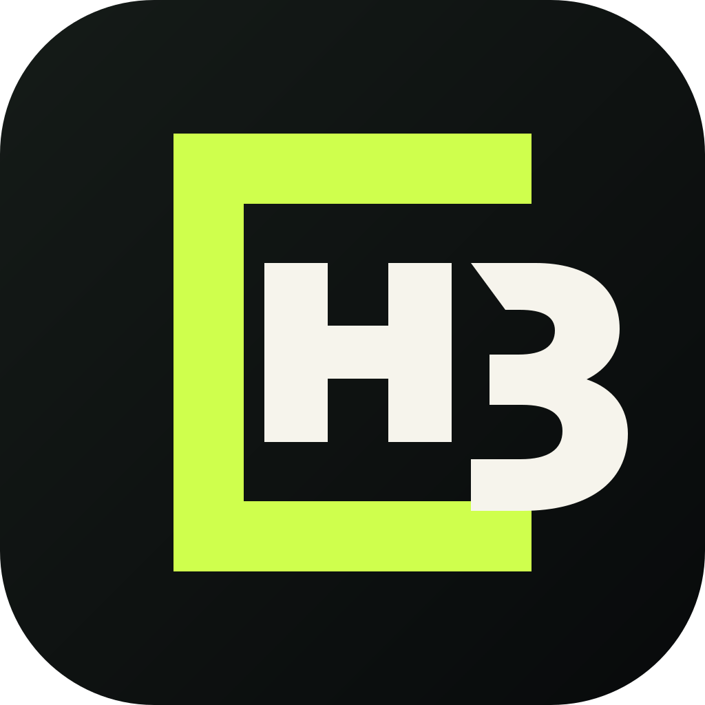
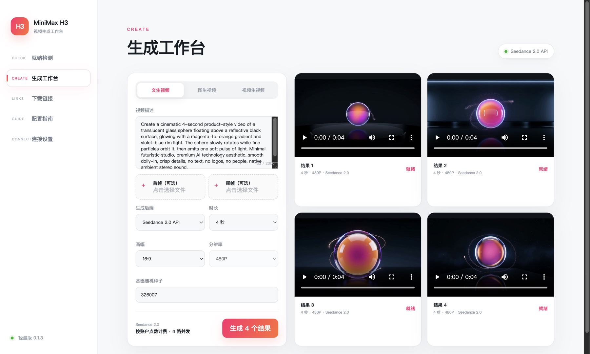
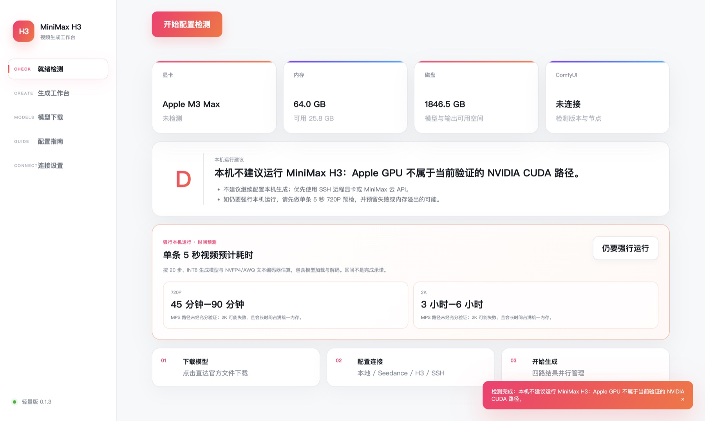
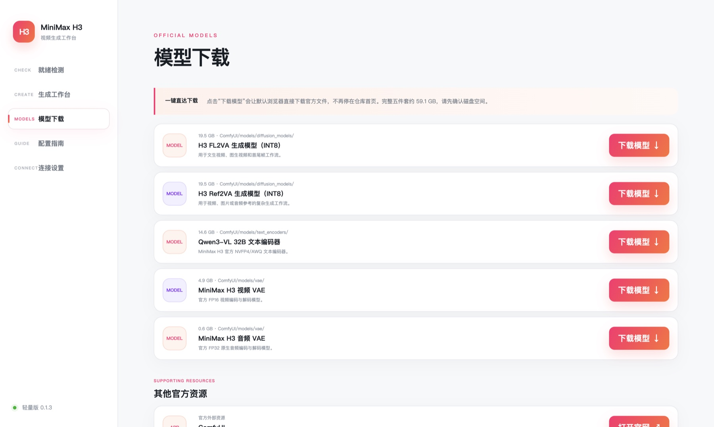

<p align="center">
  
</p>

<h1 align="center">MiniMax H3 工作台</h1>

<p align="center">
  先判断怎么跑，再开始生成。<br>
  把环境检测、模型下载、ComfyUI、云 API、SSH 和四路视频生成放进一个桌面工作台。
</p>

<p align="center">
  <a href="https://github.com/francoeur003/minimax-h3-workbench/releases/latest"></a>
  <a href="https://github.com/francoeur003/minimax-h3-workbench/actions/workflows/build.yml"></a>
  
  <a href="./LICENSE"></a>
</p>

<p align="center">
  <a href="https://github.com/francoeur003/minimax-h3-workbench/releases/latest"><strong>下载最新版</strong></a>
  · <a href="#产品界面">查看界面</a>
  · <a href="#快速开始">快速开始</a>
  · <a href="./SECURITY.md">安全说明</a>
</p>



## 从检测到生成，一条线跑通

| 01 · 判断本机能不能跑 | 02 · 下载官方模型 | 03 · 选择生成路径 |
| --- | --- | --- |
| 检测 GPU、显存、内存、磁盘、FFmpeg、ComfyUI、H3 节点与五个模型 | 五个必需模型一键直达官方文件，并标注体积与存放目录 | 本机 ComfyUI、SSH 远程显卡、MiniMax H3 云 API、Seedance 2.0 API |

## 产品界面

### 就绪检测与时间预测

检测完成后给出 A–D 级建议。配置不适合本机运行时会明确提示风险；如果仍要强行运行，会按当前硬件预测单条 5 秒视频的 720P 与 2K 耗时区间。



### 模型下载

不再停留在仓库首页。点击“下载模型”即可由默认浏览器下载官方文件，同时显示模型大小和对应的 ComfyUI 目录。



### 四路生成工作台

支持文生视频、图生视频、视频生视频和首尾帧控制。一次提交四个结果，并列查看进度、成片和保存位置。


## 核心能力

- **配置检测**：读取 CPU、内存、GPU/显存、磁盘、FFmpeg、ComfyUI、H3 原生节点与五个模型文件状态。
- **运行建议**：根据硬件给出本机、SSH 远程显卡或云 API 建议，并预测强行本机运行耗时。
- **官方模型直达**：提供 MiniMax H3 五个必需模型的官方文件下载入口；工作台不代理、不缓存权重。
- **四种生成后端**：本机 ComfyUI、SSH ComfyUI、MiniMax H3 云 API、Seedance 2.0 API。
- **四路并行结果**：统一管理四个生成任务的进度、取消、输出和异常恢复。
- **凭据安全存储**：API Key、Seedance 账号密码和 SSH 密码使用 Electron `safeStorage` 加密。
- **版本更新提醒**：启动时自动检查 GitHub Release；左下角可手动检查，有新版时一键打开官方下载页。

## 快速开始

### 直接安装

前往 [Releases](https://github.com/francoeur003/minimax-h3-workbench/releases/latest) 下载：

- macOS Apple Silicon：`DMG` 或 `ZIP`
- Windows x64：`NSIS` 安装程序

模型权重与 ComfyUI 不包含在安装包中。首次启动先运行“就绪检测”，再进入“模型下载”按目录安装所需文件。

> macOS 公共构建未经过 Apple 公证。若系统阻止首次启动，请在“系统设置 → 隐私与安全性”中确认来源后允许打开。

### 本地开发

要求 Node.js 24+。

```bash
npm install
npm run dev
```

验证与打包：

```bash
npm test
npm run typecheck
npm run build
npm run package:mac
# Windows 环境执行：npm run package:win
```

## 运行方式

| 方式 | 适用场景 | 说明 |
| --- | --- | --- |
| 本机 ComfyUI | 已验证的 NVIDIA CUDA 环境 | 默认连接 `http://127.0.0.1:8188` |
| SSH 远程显卡 | 本机显存不足但有远端 GPU | 通过 SSH 隧道连接远端回环地址，无需暴露 8188 |
| MiniMax H3 云 API | 希望免维护本地环境 | 使用自己的 API Key，异步生成并自动保存结果 |
| Seedance 2.0 API | 已有 Kuaizi OpenAPI 账号 | 登录鉴权、轮询任务并支持四路并发 |

具体模型目录、ComfyUI 启动方式和首尾帧用法均已内置在软件“配置指南”页面。

## 安全边界

- 模型文件来自官方仓库；许可证、地域限制与商业使用条件由使用者自行确认。
- 不要把 ComfyUI API 端口直接开放到公网；远程使用请走 SSH。
- 首次连接 SSH 主机后，请确认并固定 SHA-256 主机指纹。
- 云 API 会产生费用，四路生成会提交四个任务；界面金额仅为估算，以服务商账单为准。
- 生成内容需遵守适用法律、平台规则与素材授权要求。

更多说明见 [安全说明](./SECURITY.md)、[架构设计](./docs/ARCHITECTURE.md)、[产品需求文档](./PRD.md) 和 [PRD 自审](./PRD-SELF-REVIEW.md)。

## 当前验收状态

- TypeScript 类型检查：通过
- Vitest：18 项通过
- Vite 生产构建：通过
- Electron 真实页面截图验收：通过
- macOS arm64 DMG/ZIP：构建、签名校验并从打包 App 启动通过
- Windows 安装包：由 GitHub Actions 在 Windows runner 构建

## 许可证

工作台源码使用 [MIT License](./LICENSE)。MiniMax H3 模型及相关资产使用各自仓库声明的许可证，二者互不替代。
