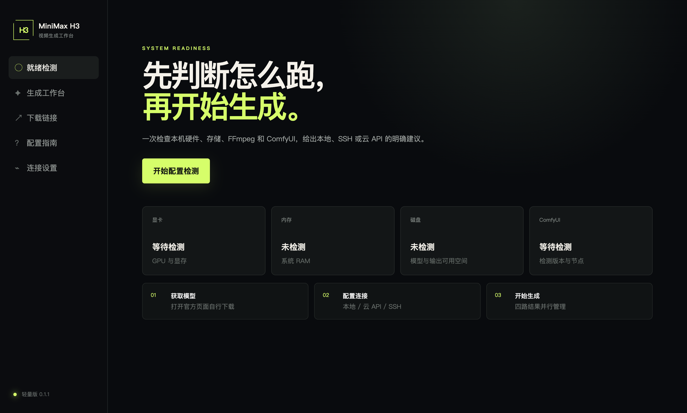

# MiniMax H3 工作台

一个面向 MiniMax H3 的轻量桌面工作台，把配置检测、官方资源链接、ComfyUI 配置、四路视频生成、本地/云端/SSH 连接放到同一个软件里。



## 已实现

- 检测 CPU、内存、GPU/显存、磁盘、FFmpeg、ComfyUI 和 H3 原生节点，给出 A–D 级运行建议。
- 只提供模型、ComfyUI、工作流和 API 文档的官方外链；不内置也不代下载大文件。
- 内置 ComfyUI、本地部署、SSH 远程显卡、MiniMax 云 API 配置指南。
- 文生视频、图生视频、视频生视频；文生视频支持首帧/尾帧控制。
- 左侧输入与参数区，右侧 2×2 四路生成结果、进度、取消和文件定位。
- 三种生成适配器：本机 ComfyUI、SSH 隧道后的远程 ComfyUI、MiniMax H3 云 API。
- 任务持久化；异常退出后的未完成任务会标记为“已中断”。
- API Key 与 SSH 密码使用 Electron `safeStorage` 加密，不写入日志或 Git。

## 下载与安装

GitHub Actions 会在每次推送 `main` 后构建：

- macOS Apple Silicon：DMG 与 ZIP
- Windows x64：NSIS 安装程序

在仓库的 **Actions → build-desktop → Artifacts** 下载对应平台构建。当前本地构建未做 Apple Developer 签名和公证，macOS 首次打开可能需要在“系统设置 → 隐私与安全性”中手动允许。

模型权重与 ComfyUI 均不包含在软件安装包中。首次使用请进入“下载链接”，在官方页面阅读许可证并自行下载。

## 本地开发

要求 Node.js 24+。

```bash
npm install
npm run dev
```

验证与打包：

```bash
npm test
npm run typecheck
npm run build
npm run package:mac
# Windows 环境执行：npm run package:win
```

## 三种运行方式

1. 本机 ComfyUI：默认连接 `http://127.0.0.1:8188`，适合满足显存与内存条件的 NVIDIA 设备。
2. SSH 远程显卡：通过本地端口转发访问远端回环地址上的 ComfyUI，无需把 8188 暴露到公网。
3. MiniMax 云 API：使用自己的 MiniMax API Key，工作台提交异步任务、轮询状态并保存结果。

具体模型目录、ComfyUI 启动方式和首尾帧用法均已内置在软件“配置指南”页面。

## 安全边界

- 本软件不会附带、缓存、代理下载或代发模型权重，模型许可证与费用由使用者自行确认。
- 不要把 ComfyUI API 端口直接开放到公网；远程使用请走 SSH。
- 首次连接 SSH 主机后，请确认并固定 SHA-256 主机指纹。
- 云 API 会产生费用，四路生成会提交四个任务；界面中的金额仅为估算，应以 MiniMax 官方账单为准。
- 生成内容需遵守适用法律、平台规则与素材授权要求。

更多说明见 [SECURITY.md](./SECURITY.md)、[架构设计](./docs/ARCHITECTURE.md)、[产品需求文档](./PRD.md) 和 [PRD 自审](./PRD-SELF-REVIEW.md)。

## 当前验收状态

- TypeScript 类型检查：通过
- Vitest：6 项通过
- Vite 生产构建：通过
- Electron 开发包启动与截图：通过
- macOS arm64 DMG/ZIP：构建、校验并从打包 App 启动通过
- Windows 安装包：由 GitHub Actions 在 Windows runner 构建

## 许可证

工作台源码使用 MIT License。MiniMax H3 模型及相关资产使用各自仓库声明的许可证，二者互不替代。
